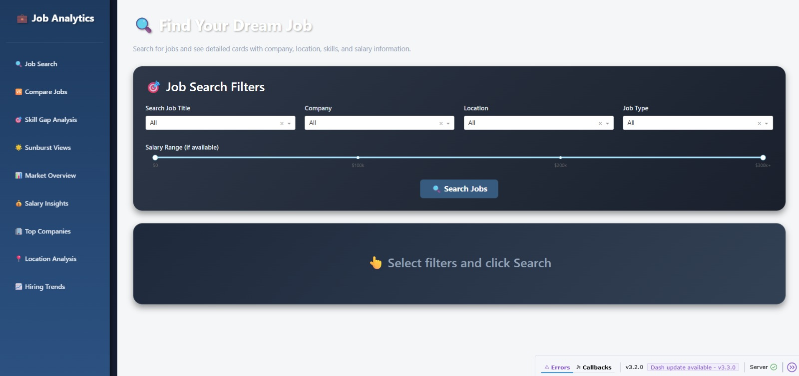
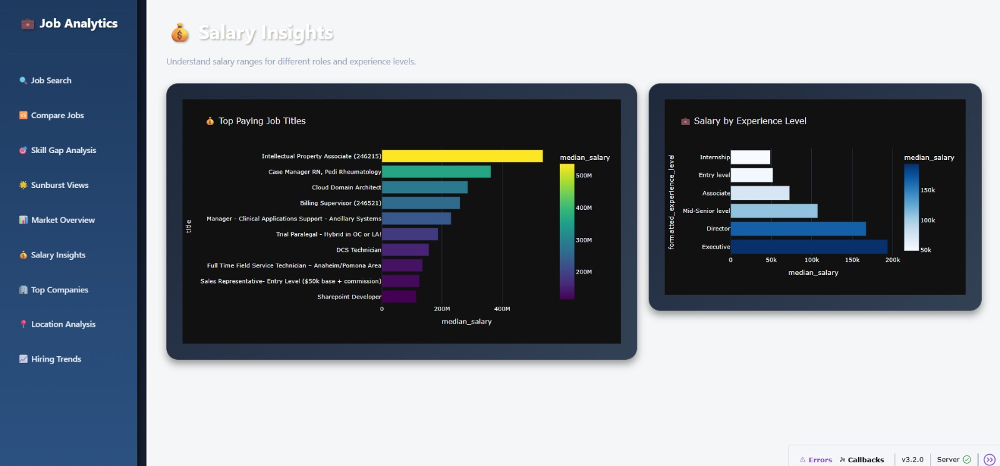
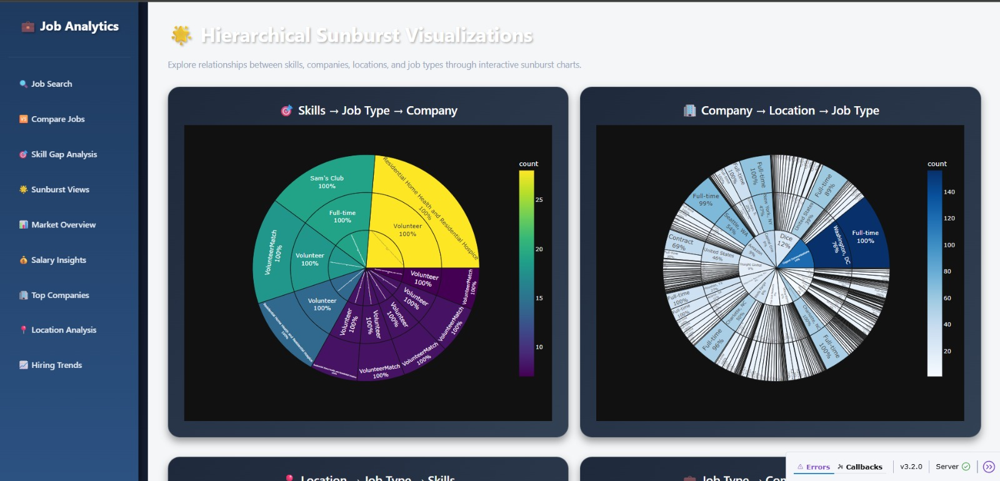

# 📊 LinkedIn Job Analytics Dashboard


---

## 🚀 Overview

An end-to-end **Big Data Analytics Project** that analyzes LinkedIn job postings (2023–2024) to uncover hiring trends, in-demand skills, and industry patterns.

This project demonstrates a complete data pipeline:

👉 **Big Data Processing (Hive) → Data Transformation → Visualization (Dash / Plotly)**

---

## ✨ Features

* 📌 Interactive web dashboard
* 📊 Multiple visualizations (bar, line, pie, sunburst)
* 🎯 Dynamic filtering (skills, job types)
* 🧭 Sidebar-based navigation
* 🔍 Insights into:

  * Job trends over time
  * Top hiring companies
  * In-demand skills
  * Location-based job distribution
  * Job type analysis

---

## 🛠️ Tech Stack

### 🔹 Big Data Processing

* Apache Hive (HiveQL for large-scale querying)

### 🔹 Data Analysis

* Python (Pandas)

### 🔹 Visualization

* Dash & Plotly (Interactive dashboard)
* Tableau *(conceptual / optional layer)*

### 🔹 Frontend

* HTML, CSS
* Dash Bootstrap Components

---

## 📁 Project Structure

```
job-application-trend-analysis/
│
├── linkedin_dashboard.py        # Main dashboard application
├── assets/                     # Styling (CSS)
├── *.csv                       # Processed datasets (lightweight)
├── README.md
```

---

## 📊 Dataset

* LinkedIn Job Postings Dataset (2023–2024)
* ~865,000 records
* Processed using Apache Hive

⚠️ **Note:**
The raw dataset is not included due to size constraints.
Only processed CSV files used for visualization are provided.

---

## ▶️ How to Run

### 1️⃣ Install dependencies

```bash
pip install dash plotly pandas dash-bootstrap-components
```

### 2️⃣ Run the application

```bash
python linkedin_dashboard.py
```

### 3️⃣ Open in browser

```
http://127.0.0.1:8050/
```

---

## 📈 Visualizations

* 📊 Top Companies Hiring
* 🌍 Top Locations
* 💼 Top Job Titles
* 🧠 Top Skills
* 🧾 Job Type Distribution
* 📅 Monthly Job Trends
* 🏢 Company vs Job Type
* 📍 Location vs Job Type
* 🌐 Sunburst (Skills → Job Type → Company)

---

## 📸 Screenshots


### 📊 Dashboard Overview


### 💰 Salary Insights


### 🌐 Skill Analysis (Sunburst)


## 🎯 Key Highlights

* Handled large-scale dataset (~865K records)
* Built an interactive analytics dashboard
* Implemented real-world data pipeline concepts
* Extracted actionable insights from job market data

---

## 👩‍💻 Author

**Madhu (Madhumathi R)**

---

## 📄 License

This project is intended for **educational and academic purposes only**.
